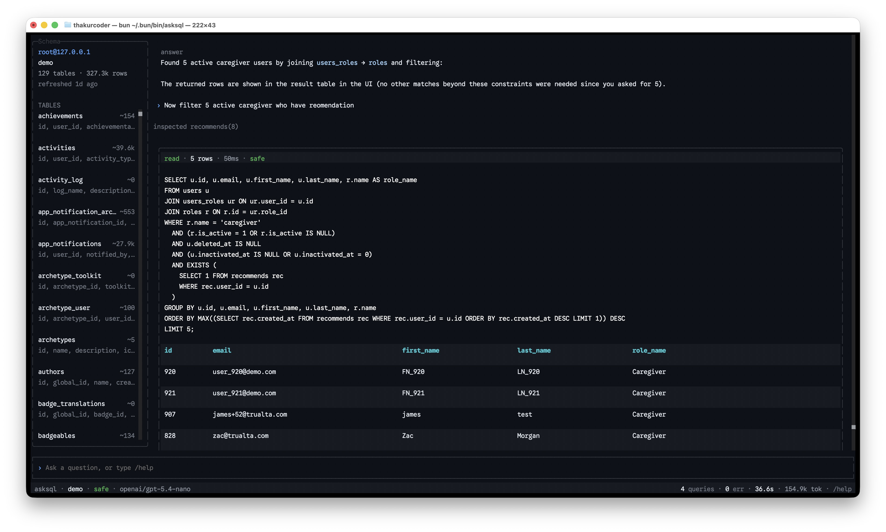

# AskSQL

Natural-language MySQL assistant powered by OpenRouter and OpenTUI.

Ask questions in plain English; AskSQL inspects schema, runs gated SQL, and shows results in a terminal UI or CLI.



## Install

```bash
bun install
bun link
```

Create a `.env` in the project root (or anywhere up to the git root):

```bash
OPENROUTER_API_KEY=sk-or-...
# ASKSQL_MODEL=openai/gpt-5.4-nano   # optional
# ASKSQL_MODE=safe                   # optional: safe | confirm | yolo
```

AskSQL loads `.env` in this order (first wins; already-set env vars are not overridden):

1. Current directory → git root
2. This package’s install directory
3. `~/.asksql/.env` (fallback; legacy `~/.dbai/.env` if you upgraded from dbai)

Legacy env names `DBAI_MODEL` and `DBAI_MODE` still work.

## Usage

Run **`asksql`** to open the TUI (default). Profile setup and switching happen inside the app with slash commands.

```bash
asksql                  # launch TUI (same as asksql tui)
asksql -p demo          # TUI with profile pre-selected
asksql ask "how many users?"   # one-shot CLI (scripts)
asksql list             # list profiles from shell
asksql alias            # add alias ai=asksql to shell rc
```

After `bun link`, the binary is at `~/.bun/bin/asksql` (ensure `~/.bun/bin` is on your `PATH`).

### Slash command autocomplete

Type `/` in the prompt to open a command menu above the input. Each row shows the command and a short description (e.g. `/new` · create new chat). Only the **command** is inserted when you accept — not the description.

| Key | Action |
|-----|--------|
| `↑` / `↓` | Move selection |
| `Tab` / `→` | Accept highlighted command into the prompt |

Arg-taking commands (e.g. `/use`, `/profile`, `/mode`) insert with a trailing space so you can keep completing (profile names, modes, tables).

### In-app slash commands

Commands are grouped by what you’re doing: **chat** vs **database** vs **session**.

| Command | Action |
|---------|--------|
| `/new` or `/chat` | **New chat** — clear screen and agent memory (same as `Ctrl+L`) |
| `/clear` | Alias for `/new` |
| `/profile new` | Add a MySQL connection (wizard) |
| `/profile list` or `/profiles` | List saved connections |
| `/use <name>` | Switch database and start a new chat |
| `/connect <name>` | Alias for `/use` |
| `/mode safe\|confirm\|yolo` | Change safety mode |
| `/model <id>` | Change OpenRouter model |
| `/refresh` | Re-introspect schema |
| `/schema [table]` | Show schema summary |
| `/help` | Show shortcuts |
| `/quit` | Exit |

**Tip:** `/new` starts a fresh conversation on the **same** database. `/use other_db` switches DB and also starts fresh. Chat is blocked until `/profile new`, `/use <name>`, or `/project use <name>`.

### Projects (multi-database chat)

Group several profiles under one **project** to ask cross-database questions in a single chat. The agent sees schema summaries for every profile in the project (higher token usage per turn).

| Command | Action |
|---------|--------|
| `/project new` | Create a project from existing profiles |
| `/project list` | List projects and member profiles |
| `/project use <name>` | Switch to project mode (+ new chat) |
| `/project add <profile>` | Add profile to active project |

CLI:

```bash
asksql project list
asksql project new trualta demo analytics
asksql project use trualta
```

**Scenario 1 (single profile):** `/use demo` — one DB, lowest cost.  
**Scenario 2 (project):** `/project use trualta` — agent queries multiple DBs; each tool call must specify `profile`. Max 8 profiles per project.

When a project has more than 3 profiles, the status bar shows `↑tokens` as a cost reminder.

| Key | Action |
|-----|--------|
| `Ctrl+P` | Command palette |
| `Ctrl+L` | New chat (`/new`) |
| `Ctrl+R` | Refresh schema |
| `Ctrl+C` | Quit |
| `/help` | Toggle help overlay |
| `Esc` | Close help or palette |

## Safety modes

| Mode | Reads | Writes / DDL |
|------|-------|----------------|
| `safe` | Allowed | Denied |
| `confirm` | Allowed | Requires confirmation in TUI |
| `yolo` | Allowed | Allowed without prompt |

Default mode comes from `ASKSQL_MODE` (or legacy `DBAI_MODE`) or `~/.asksql/config.toml`.

## Config & profiles

**Global config** — `~/.asksql/config.toml` (or legacy `~/.dbai/config.toml`)

- `default_model`, `default_mode`, `active_profile`, `active_project`

**Per-database profile** — `~/.asksql/profiles/{database}/`

| File | Purpose |
|------|---------|
| `connection.env` | MySQL host, port, user, password |
| `schema.json` | Cached introspection (refreshed on demand) |
| `memory.md` | Agent notes appended across sessions |
| `history.jsonl` | Optional session history |

**Project** — `~/.asksql/projects/{name}/project.toml`

| Field | Purpose |
|-------|---------|
| `name` | Project identifier |
| `description` | Optional note |
| `profiles` | List of profile names in this project |

Existing **dbai** users keep profiles under `~/.dbai/` automatically until you migrate:

```bash
mv ~/.dbai ~/.asksql
```

## Project structure

```
src/
  cli/           CLI commands (citty)
  core/
    agent/       OpenRouter tool loop
    safety/      SQL classifier & mode gating
    schema/      MySQL introspection
    profiles/    Profile CRUD
    env.ts       Env cascade & OpenRouter key
    mysql.ts     Query execution
  shared/        Shared TypeScript types
  tui/           OpenTUI React terminal UI
tests/           Unit tests (bun:test)
```

## Development

```bash
bun test              # run all tests
bun run typecheck     # tsc --noEmit
bun run tui           # TUI without linking
```

After changing the CLI entrypoint, run `bun link` so `~/.bun/bin/asksql` picks up changes.

### Architecture (short)

1. User message → `runAgentTurn()` streams `AgentEvent`s.
2. Agent calls tools: schema inspect, SQL read/write (gated), memory update.
3. TUI maps events to **transcript blocks** (user, execution cards, tables, streaming answer).
4. Pure format helpers (`tableLayout`, `transcriptMerge`, `answerSanitize`) keep rendering testable.

## Cursor AI setup

| Path | Purpose |
|------|---------|
| [`.cursor/rules/asksql-project.mdc`](.cursor/rules/asksql-project.mdc) | Always-on project standards |
| [`.cursor/rules/asksql-tui-opentui.mdc`](.cursor/rules/asksql-tui-opentui.mdc) | OpenTUI TUI conventions |
| [`.cursor/rules/asksql-agent-core.mdc`](.cursor/rules/asksql-agent-core.mdc) | Agent, safety, profiles |
| [`.cursor/skills/asksql-development/SKILL.md`](.cursor/skills/asksql-development/SKILL.md) | Development guide |
| [`.cursor/skills/asksql-tui/SKILL.md`](.cursor/skills/asksql-tui/SKILL.md) | TUI layout debugging |

See [`CLAUDE.md`](CLAUDE.md) for Bun-specific API preferences.

## License

Private POC — see repository owner for terms.
