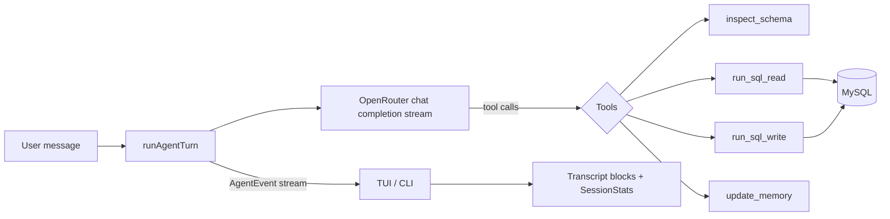

# Architecture

How a plain-English question becomes SQL and rendered results. Pairs with **[[Contributing]]** for the dev workflow.

## High-level flow



1. A user message enters `runAgentTurn()` (`src/core/agent/index.ts`).
2. The agent builds a system prompt (schema index + fenced `memory.md`), then streams a chat completion from OpenRouter.
3. The model may call **tools**; the agent executes each and feeds the result back, looping until it produces a final answer or hits `MAX_AGENT_STEPS` (10).
4. Throughout, the agent emits **`AgentEvent`s**. The TUI maps them to transcript blocks and accumulates session stats; the CLI streams the answer to stdout.

## The agent tool loop

The agent exposes four tools to the model:

| Tool | Purpose | Safety |
|------|---------|--------|
| `inspect_schema` | Return all tables (summary) or one table's columns/keys/FKs from cached `schema.json`. | Read-only, local file. |
| `run_sql_read` | Run a read-only query. | `enforceReadOnly` + `START TRANSACTION READ ONLY` + row cap. |
| `run_sql_write` | Run a write/DDL statement. | Classified and **mode-gated**; may require confirmation. |
| `update_memory` | Append an observation under a heading in `memory.md`. | Local file; bounded section insert. |

The loop streams deltas: text deltas become `answer-chunk` events; `tool_calls` deltas are accumulated by index, parsed as JSON args, executed, and appended as `tool` messages for the next turn. Token usage is captured via `stream_options: { include_usage: true }` and emitted as a `usage` event.

Conversation history is trimmed to `MAX_CHAT_HISTORY` (20) turns. Each completed turn is appended to `history.jsonl` (best-effort).

## Events

`AgentEvent` (`src/shared/types.ts`) is the contract between core and UI:

| Event | Meaning |
|-------|---------|
| `thinking` | A model step started. |
| `schema` | Tables were inspected (names for UI highlight). |
| `execution` | A SQL tool ran — carries `sql`, `result`/`writeResult`, `error`, and `durationMs`. |
| `memory` | A memory section was updated. |
| `answer-chunk` / `answer-done` / `answer-clear` | Streaming answer lifecycle. |
| `usage` | Prompt/completion token counts for the step. |
| `error` | A turn-level error. |
| `done` | The turn finished. |

The TUI reduces these into `TranscriptBlock`s and a cumulative `SessionStats` (`queries`, `errors`, `elapsedMs`, `promptTokens`, `completionTokens`).

## Module map

```
src/
  cli/                 CLI commands (citty)
    main.ts            Command definitions, arg parsing, env bootstrap
    ask.ts             One-shot `asksql ask`
    new.ts             Interactive connection wizard
    alias.ts           Shell alias installer
  core/
    agent/index.ts     OpenRouter tool loop, system prompt, event emission
    safety/classifier.ts  SQL classification, mode gating, read-only enforcement, limits
    schema/introspect.ts   MySQL information_schema introspection
    profiles/index.ts  Profile CRUD, connection.env parse/format
    config.ts          ~/.asksql/config.toml load/save
    env.ts             .env cascade, OpenRouter key, model/mode resolution
    paths.ts           App-home resolution, profile paths, name validation
    mysql.ts           Connection + query helpers (incl. read-only transaction)
    memory.ts          memory.md generation and section append
  shared/types.ts      Shared types and constants
  tui/                 OpenTUI React terminal UI
    App.tsx            Top-level state, event handling, layout
    state/store.ts     Reducer: transcript blocks, stats, schema version
    components/        SchemaSidebar, StatusBar, Transcript, ExecutionBlock, …
    format/            Pure render helpers (testable)
    keymap.ts          Keybindings
tests/                 bun:test unit tests
```

## TUI layout

`App.tsx` renders a column of: a **main row** (collapsible `SchemaSidebar` + conversation `Transcript`), the prompt area (with slash autocomplete), and a footer `StatusBar`. Reactive terminal dimensions decide whether the sidebar shows (≥ 84 columns). A `schemaVersion` counter in the store invalidates the memoized schema read after `/refresh`.

Rendering logic that doesn't need the terminal lives in `src/tui/format/` (e.g. `tableLayout`, `transcriptMerge`, `answerSanitize`, `numbers`) so it can be unit-tested without a TTY.

## Key constants

| Constant | Value | Role |
|----------|-------|------|
| `DEFAULT_MODEL` | `openai/gpt-5.4-nano` | Fallback model. |
| `MAX_AGENT_STEPS` | 10 | Tool-loop ceiling per turn. |
| `MAX_CHAT_HISTORY` | 20 | Prior turns kept in context. |
| `DEFAULT_READ_LIMIT` | 100 | Default `LIMIT` for exploratory reads. |
| `MAX_READ_ROWS` | 5,000 | Server-side `SQL_SELECT_LIMIT` cap. |
| `MAX_RESULT_BYTES` | 50,000 | Serialization budget for a result set. |

## On-disk layout

```
~/.asksql/
  config.toml                 default_model, default_mode, active_profile
  profiles/
    <database>/
      connection.env          MySQL credentials (0600)
      schema.json             cached introspection
      memory.md               agent notes (you can edit)
      history.jsonl           optional per-question log
```

`ASKSQL_HOME` overrides the root; otherwise `~/.asksql`, falling back to legacy `~/.dbai` if present.
